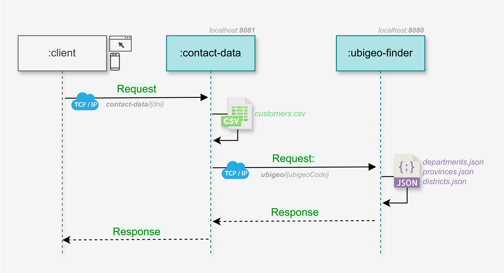

# CLIENTE-SERVIDOR CON TCP
Este proyecto implementa una comunicación cliente-servidor mediante TCP y aplica los siguientes patrones de diseño:

- DTO
- DAO
- Mapper

---

## 1. Dominio

### Ubigeo
Código de seis dígitos que identifica a un distrito del Perú. Cada par de dígitos corresponde con el departamento, 
provincia y distrito respectivamente. Por ejemplo, el código de ubigeo `150114` representa `15`: Lima, `01`: Lima y `14`: La Molina.

---

## 2. Pre requisitos

### Instalar ncat
- Descargar e instalar ncat para Windows desde: https://nmap.org/download.html#windows
- Añadir `ncat` a las variables de entorno.

---

## 3. Componentes y operaciones

### contact-data

| Operación                                               | Endpoint             |
|---------------------------------------------------------|----------------------|
| Recuperar los datos de contacto asociados a un cliente. | `contact-data/{dni}` |


### ubigeo-finder

| Operación                       | Descripción           |
|---------------------------------|-----------------------|
| Recuperar los datos del ubigeo. | `ubigeo/{ubigeoCode}` |

---

## 4. Diagrama de secuencias



---

## 5. Instrucciones de ejecución
- Instalar cada uno de los componentes con `mvn clean install`
- Iniciar cada uno de los componentes desde sus respectivas clases Application.
- Para consultar a `ubigeo-finder`, puede ejecutar el siguiente comando en la GitBash:

```sh
  echo ubigeo/150114 | ncat localhost 8080
```

- Para consultar a `contact-data`, puede ejecutar el siguiente comando en la GitBash:

```sh
  echo contact-data/76517368 | ncat localhost 8081
```
